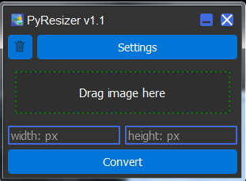

# PyResizer

PyResizer-приложение позволяющее изменять размер изображения, в несколько кликов.
В отличие от аналогов не требует уставновки. Небольшого размера и может использоваться как виджет на рабочий стол. 
Незаменимый инструмент для web-разработчика.

### В версии PyResizer v1.0 реализовано:

1. Поддержка двух форматов изображений png и jpg.
2. Моментальное изменение размера изображения, без изменения имени.
3. Возможность как загружать изображения посредством перетаскивания, так и непосредственно.
4. Задание будущего размера изображения в пикселях.
5. Возможность обрабатывать одновременно большое количество изображений.

### В версии PyResizer v1.1 добавлено и исправлено:

1. Устранена ошибка с перетаскиванием файла под ОС Linux. 
2. Добавлена возможность конвертировать сохраняя пропорции, введя только высоту или ширину.
3. Добавлена обработка ситуации, когда пытаются конвертировать не граф. файл. 
4. Добавлена очистка списка выбранных файлов.
5. Добавлена обработка пустого списка выбранных файлов.

